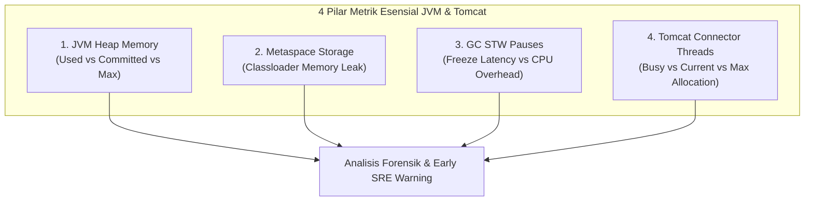

+++
title = "Deep-Dive Observability Apache Tomcat: Mengamankan JMX Exporter dengan TLS & Keystore"
date = "2026-09-20T20:00:00+07:00"
draft = false
summary = "Panduan mendalam mengamankan eksposur metrik internal JVM dan Tomcat MBeans di lingkungan produksi menggunakan Prometheus JMX Exporter Java Agent dengan enkripsi TLS/HTTPS Keystore, pemisahan isolasi konfigurasi runtime (TM-ADR-0002 & TM-ADR-0003), serta optimasi filter MBeans rendah overhead."
author = "Eddy Wiyatno"
categories = ["Observability", "JVM"]
tags = ["tomcat", "observability", "prometheus", "jmx", "security", "sre"]
series = ["JVM & Tomcat Performance Engineering"]
toc = true
showSummary = true
+++

## 📌 Ringkasan Eksekutif (TL;DR)

Mengekspos telemetri internal Java Virtual Machine (JVM) dan Apache Tomcat MBeans adalah fondasi mutlak dalam membangun sistem observabilitas performa enterprise yang andal. Namun, di lingkungan produksi, implementasi pemantauan sering kali menghadapi dilema keamanan dan stabilitas: menggunakan antarmuka standar **Remote JMX berbasis Java RMI (Remote Method Invocation)** membuka celah keamanan kritis (*plaintext network transmission*, eksploitasi *deserialization Remote Code Execution*, dan kerumitan *firewall traversal*). Di sisi lain, memasang *monitoring agent* dan sertifikat keamanan secara sembarangan langsung ke dalam *base container image* melanggar prinsip *immutability* dan memicu kebocoran rahasia (*credential leakage*).

Solusi arsitektur modern yang paling aman dan efisien adalah mengintegrasikan **Prometheus JMX Exporter sebagai Java Agent *in-process*** yang mengekspos metrik telemetri melalui antarmuka HTTP pull model terenkripsi **HTTPS (port 9404)** dengan proteksi **Java Keystore (PKCS12)**. 

Artikel teknis ini membedah secara menyeluruh:
1. Mengapa Remote JMX/RMI tradisional adalah *anti-pattern* berbahaya di jaringan *production*.
2. Pemisahan arsitektur antara *generic runtime image* dan konfigurasi monitoring berdasarkan [`TM-ADR-0002`](https://edkas07-oss.github.io/devops-handbook/adr/tomcat-monitoring/adr-records/TM-ADR-0002/).
3. Manajemen *host-managed non-Git TLS material* dan injeksi rahasia tanpa kebocoran kode merujuk pada [`TM-ADR-0003`](https://edkas07-oss.github.io/devops-handbook/adr/tomcat-monitoring/adr-records/TM-ADR-0003/).
4. Strategi *whitelisting* pola MBeans untuk menjaga *scraping overhead* CPU tetap berada di bawah 1–2%.
5. Analisis 4 metrik krusial JVM dan Tomcat (*Heap Memory*, *Metaspace Classloading*, *GC STW Latency*, dan *Connector Thread Saturation*).

---

## 🌍 Latar Belakang & Real-World Dilemma: Mengapa Remote JMX/RMI Berbahaya di Production?

Java Management Extensions (JMX) telah menjadi standar instrumentasi aplikasi Java sejak era J2SE 5.0. Melalui JMX MBeanServer, runtime JVM mengekspos ribuan atribut internal, mulai dari statistik memori, alokasi thread, hingga status konektor HTTP Tomcat Catalina.

Secara historis, administrator memantau metrik ini dengan mengaktifkan Remote JMX pada opsi JVM (`CATALINA_OPTS`):

```bash
# ⚠️ ANTI-PATTERN: Konfigurasi Remote JMX/RMI Tradisional yang Tidak Aman
-Dcom.sun.management.jmxremote
-Dcom.sun.management.jmxremote.port=1099
-Dcom.sun.management.jmxremote.rmi.port=1099
-Dcom.sun.management.jmxremote.ssl=false
-Dcom.sun.management.jmxremote.authenticate=false
```

Meskipun terlihat mudah, mengaktifkan Remote JMX berbasis Java RMI di jaringan produksi membuka serangkaian risiko operasional dan keamanan tingkat tinggi:


flowchart TD
    subgraph JMX_FLAWS["4 Celah Kritis Remote JMX / RMI Standar"]
        F1["1. Java Deserialization RCE<br/>(Eksploitasi Remote Code Execution via RMI)"]
        F2["2. Plaintext Communication<br/>(Kredensial & Telemetri Tanpa Enkripsi)"]
        F3["3. Dynamic Port Traversal<br/>(RMI Server Port Acak Membingungkan Firewall)"]
        F4["4. Incompatible Pull Scraper<br/>(Prometheus Tidak Dapat Membaca Protokol Biner RMI)"]
    end

    JMX_FLAWS --> OUTCOME["Risiko Kompromi Sistem Host & Kegagalan Observabilitas"]


### 1. Celah Deserialization Remote Code Execution (RCE)
Protokol Java RMI bekerja dengan melakukan serialisasi dan deserialisasi objek Java secara dinamis melalui jaringan. Jika port RMI terekspos tanpa kontrol otorisasi yang sangat ketat, penyerang dapat mengirimkan *crafted serialized payload* (menggunakan pustaka eksploitasi seperti *ysoserial*, *Spring Framework gadget chains*, atau *Apache Commons Collections*). Hasilnya, penyerang dapat mengeksekusi perintah shell arbitrer (*Remote Code Execution*) dengan hak akses pengguna yang menjalankan proses Tomcat.

### 2. Transmisi Data Plaintext Tanpa Enkripsi Standar
Secara default, autentikasi JMX hanya mengandalkan berkas `jmxremote.password` sederhana. Komunikasi biner RMI tidak terenkripsi secara default, sehingga kredensial administratif dan data telemetri bisnis yang mengalir di jaringan lokal (*internal East-West traffic*) rentan terhadap serangan *packet sniffing* dan *Man-in-the-Middle (MitM)*.

### 3. Kerumitan Firewall & Container Port Traversal
Arsitektur Java RMI menggunakan dua port terpisah: **RMI Registry Port** (misalnya port 1099) dan **RMI Dynamic/Server Port** yang dialokasikan secara acak oleh JVM saat runtime (*ephemeral port*). Pada lingkungan *containerized* (Docker, Podman, Kubernetes) atau jaringan ber-firewall ketat, memetakan port acak ini menjadi mimpi buruk operasional yang kerap memicu kegagalan koneksi (*connection refused / timeout*).

### 4. Inkonsistensi dengan Ekosistem Observabilitas Modern
Prometheus beroperasi menggunakan model *HTTP Pull* berbasis teks terstruktur (OpenMetrics). Prometheus tidak dapat melakukan koneksi soket biner langsung ke RMI Registry. Menggunakan *sidecar standalone exporter* yang melakukan koneksi RMI eksternal ke Tomcat hanya memindahkan masalah, tanpa menyelesaikan celah keamanan RMI itu sendiri.

> [!CAUTION]
> Membuka port Java Remote JMX (1099 / 9010) ke jaringan tanpa autentikasi TLS timbal balik (mTLS) dan otorisasi ketat setara dengan memberikan akses terminal *unrestricted* ke dalam server aplikasi Anda.

---

## 🏛️ Solusi Arsitektur: In-Process JMX Java Agent via TLS (Port 9404)

Untuk mengatasi seluruh kelemahan di atas, arsitektur pemantauan Tomcat kami mengadopsi **Prometheus JMX Exporter sebagai Java Agent *in-process*** yang mendengarkan permintaan scraping langsung pada port tunggal **HTTPS 9404**.


flowchart LR
    subgraph TOMCAT_JVM["Tomcat Container / Process (JVM Runtime)"]
        APP["Tomcat Catalina Core & Servlets"] -->|In-Memory Registration| MB["JVM MBeanServer<br/>(Memory, GC, ThreadPool)"]
        AGENT["JMX Exporter Java Agent<br/>(jmx_prometheus_javaagent.jar)"] -->|Zero-Copy Local Read| MB
        AGENT -->|Internal HTTPS Server| TLS_SRV["TLS/HTTPS Server Engine<br/>(:9404 /metrics)"]
    end

    subgraph SECRETS["Host-Managed Secrets (:ro)"]
        KS["PKCS12 Keystore<br/>(keystore.p12 0600)"] -.->|Read Key & Cert| TLS_SRV
        PASS["Password File<br/>(keystore-password 0600)"] -.->|Read Secret| TLS_SRV
    end

    subgraph PROMETHEUS_SERVER["Observability Scraper"]
        PROM["Prometheus Server"] -->|CA Certificate Verification| CA["jmx-exporter-ca.crt<br/>(0444)"]
        PROM -->|HTTPS GET /metrics :9404| TLS_SRV
    end


### Keunggulan Arsitektur Java Agent In-Process:
1. **Zero Network Hop (In-Memory Access):** Agent berjalan di dalam *address space* JVM yang sama. Data MBeans dibaca langsung dari `ManagementFactory.getPlatformMBeanServer()` melalui pemanggilan fungsi lokal di memori tanpa overhead soket jaringan atau RMI serialisasi.
2. **Deterministic Port Binding:** Hanya satu port TCP (9404) yang dibuka secara deterministik, menyederhanakan konfigurasi *firewall*, *container port mapping*, dan *network security group*.
3. **Standarisasi OpenMetrics:** Metrik JVM dikonversi secara real-time menjadi format teks Prometheus yang bersih, siap dikonsumsi oleh scraper standar.
4. **Enkripsi End-to-End dengan TLS:** Lalu lintas scraping diamankan sepenuhnya dengan sertifikat digital X.509 dan TLS Keystore, menjamin kerahasiaan telemetri dan keaslian *endpoint*.

---

## 🧱 Isolasi Konfigurasi vs Runtime Base Image (TM-ADR-0002)

Salah satu kesalahan paling fatal dalam rekayasa container (*container engineering*) adalah membuat *fat image* yang menggabungkan binary runtime aplikasi bersama artefak konfigurasi monitoring spesifik lingkungan, kredensial, dan sertifikat TLS.

Berdasarkan keputusan arsitektur resmi [`TM-ADR-0002: Separate Generic Runtime Images from Monitoring Integration Configuration`](https://edkas07-oss.github.io/devops-handbook/adr/tomcat-monitoring/adr-records/TM-ADR-0002/), kami memisahkan repositori dan artefak ke dalam dua domain yang memiliki *lifecycle* independen:

| Dimensi | Generic Runtime Image | Monitoring Integration Configuration |
| :--- | :--- | :--- |
| **Repositori & Scope** | Base runtime repository (misal `tomcat:9.0-jdk11`) | Repository integrasi (`tomcat-monitoring`) |
| **Isi Artefak** | Binary Tomcat, OS libraries, Java Agent JAR (`/opt/jmx-exporter/`) | `config.yml`, alert rules, scrape target, volume mounting |
| **Lifecycle & Rilis** | Diperbarui saat ada *patch* keamanan JVM / OS / Tomcat upstream | Diperbarui saat ada penyesuaian aturan metrik atau target baru |
| **Karakteristik** | Reusable, tanpa rahasia (*secret-free*), agnostik terhadap environment | Spesifik lab/staging/production, memuat referensi secret host |

### Mengapa Konfigurasi & Secret Tidak Boleh Di-hardcode ke Base Image?
1. **Container Immutability:** Image container yang sama persis (`tomcat-jmx:latest`) harus dapat dipromosikan dari lingkungan Development, Staging, hingga Production tanpa perlu di-*rebuild*.
2. **Pencegahan Kebocoran Kredensial:** Menyimpan berkas sertifikat, private key, atau password keystore ke dalam lapisan (*layer*) Dockerfile berisiko tinggi mempublikasikan data sensitif ke *container registry* publik atau internal.
3. **Independensi Rotasi:** Mengubah konfigurasi filter metrik atau memperbarui sertifikat TLS tidak boleh menuntut kompilasi ulang citra container Tomcat.

### Implementasi Runtime Mounting & Entrypoint Orchestration

Pada implementasi nyata di lingkungan Linux container, berkas JAR Java Agent disematkan pada direktori biner sistem, sedangkan konfigurasi `config.yml` dan material TLS disuntikkan saat container dijalankan (*runtime mount*):

```dockerfile
# Snippet Dockerfile: docker/linux/tomcat-jmx-exporter.Dockerfile
ARG BASE_IMAGE=docker.io/library/tomcat:9.0
FROM ${BASE_IMAGE}

ARG JMX_EXPORTER_VERSION=1.6.0
ARG JMX_EXPORTER_SHA256=a95983fd96e865d2bcdf911cc500e7c82808c27ab9fd226bf96732b6c3d8c46e

LABEL maintainer="Eddy Wiyatno" \
      description="Generic Linux Container for Tomcat with JMX Exporter Agent"

ENV JMX_EXPORTER_PORT=9404 \
    JMX_EXPORTER_CONFIG=/etc/tomcat-jmx-exporter/config.yml \
    JMX_EXPORTER_KEYSTORE=/run/secrets/tomcat-jmx-exporter/keystore.p12 \
    JMX_EXPORTER_KEYSTORE_PASSWORD_FILE=/run/secrets/tomcat-jmx-exporter/keystore-password

# Download dan verifikasi integritas Java Agent binary
ADD https://github.com/prometheus/jmx_exporter/releases/download/${JMX_EXPORTER_VERSION}/jmx_prometheus_javaagent-${JMX_EXPORTER_VERSION}.jar /opt/jmx-exporter/jmx_prometheus_javaagent.jar
RUN chmod 0444 /opt/jmx-exporter/jmx_prometheus_javaagent.jar

COPY entrypoint.sh /jmx-exporter-entrypoint.sh
RUN chmod 0555 /jmx-exporter-entrypoint.sh

EXPOSE 8080 9404

ENTRYPOINT ["/jmx-exporter-entrypoint.sh"]
CMD ["catalina.sh", "run"]
```

Skrip `entrypoint.sh` bertindak sebagai *orchestrator guard* yang memvalidasi ketersediaan volume konfigurasi dan secret sebelum mengaktifkan agent pada runtime JVM:

```bash
#!/usr/bin/env bash
# Snippet: docker/linux/entrypoint.sh (Architecture Reference: TM-ADR-0002 & TM-ADR-0026)
set -euo pipefail

readonly AGENT_JAR=/opt/jmx-exporter/jmx_prometheus_javaagent.jar
readonly CONFIG_FILE="${JMX_EXPORTER_CONFIG:-/etc/tomcat-jmx-exporter/config.yml}"
readonly KEYSTORE_FILE="${JMX_EXPORTER_KEYSTORE:-/run/secrets/tomcat-jmx-exporter/keystore.p12}"
readonly PASSWORD_FILE="${JMX_EXPORTER_KEYSTORE_PASSWORD_FILE:-/run/secrets/tomcat-jmx-exporter/keystore-password}"
readonly EXPORTER_PORT="${JMX_EXPORTER_PORT:-9404}"

configure_java_agent() {
    # Pastikan seluruh prasyarat konfigurasi & TLS secret terpasang
    if [[ -f "${AGENT_JAR}" && -f "${CONFIG_FILE}" && -f "${KEYSTORE_FILE}" && -f "${PASSWORD_FILE}" ]]; then
        local password
        IFS= read -r password < "${PASSWORD_FILE}" || true
        [[ -n "${password}" ]] || { echo "[ERROR] Keystore password file is empty" >&2; exit 1; }

        # Ekspor password ke environment runtime container untuk substitusi jmx-exporter.yml
        export JMX_EXPORTER_KEYSTORE_PASSWORD="${password}"
        
        # Suntikkan Java Agent ke opsi startup Tomcat
        export CATALINA_OPTS="${CATALINA_OPTS:+${CATALINA_OPTS} }-javaagent:${AGENT_JAR}=0.0.0.0:${EXPORTER_PORT}:${CONFIG_FILE}"
        echo "✅ JMX Exporter Java Agent configured on HTTPS port ${EXPORTER_PORT}"
    else
        echo "⚠️ JMX Exporter prerequisites not mounted. Starting Tomcat standalone..."
    fi
}

configure_java_agent
exec "$@"
```

---

## 🔒 Pengamanan Jalur Metrik dengan HTTPS/TLS Keystore (TM-ADR-0003)

Setelah arsitektur container terisolasi, jalur transmisi telemetri wajib dilindungi dengan enkripsi TLS. Merujuk pada keputusan arsitektur [`TM-ADR-0003: Use Host-Managed Non-Git TLS Material for the Persistent Lab`](https://edkas07-oss.github.io/devops-handbook/adr/tomcat-monitoring/adr-records/TM-ADR-0003/), seluruh material sertifikat dikelola secara mandiri di host (*host-managed*) di luar pelacakan Git.

### 1. Hierarki Hak Akses & Isolasi Secret (*Least-Privilege File Permissions*)
Material kriptografi disimpan pada direktori host rootless dengan pengaturan izin berkas yang sangat ketat:

```text
/var/data/secrets/tomcat-monitoring/
├── [drwx------ 0700]  tomcat-jmx-exporter/
│   ├── [-rw------- 0600]  keystore.p12          # PKCS12 Keystore (Private Key + Certificate)
│   └── [-rw------- 0600]  keystore-password     # Plaintext Password File (Read-Only injection)
└── [-r--r--r-- 0444]  jmx-exporter-ca.crt       # Public CA Certificate untuk Prometheus Truststore
```

- **Direktori (`0700`):** Hanya dapat diakses oleh UID pengguna runtime host.
- **Private Key / Keystore / Password (`0600`):** Hanya dapat dibaca oleh proses pemilik, dipasang ke container Tomcat sebagai *read-only volume* (`:ro,z`).
- **Public Certificate CA (`0444`):** Bersifat publik, dipasang ke container Prometheus sebagai *CA bundle truststore*.
- **Subject Alternative Name (SAN):** Sertifikat diterbitkan dengan SAN `DNS:tomcat-jmx-exporter` guna memastikan validasi identitas nama host (*hostname verification*) berjalan sempurna tanpa bypass.

### 2. Konfigurasi TLS pada JMX Exporter (`config.yml`)
JMX Exporter versi modern mendukung blok server HTTPS terintegrasi dengan kemampuan substitusi variabel lingkungan (*environment variable substitution*):

```yaml
# config/jmx-exporter/jmx-exporter.yml
---
httpServer:
  ssl:
    keyStore:
      filename: /run/secrets/tomcat-jmx-exporter/keystore.p12
      type: PKCS12
      # Password diambil secara dinamis dari environment variable yang disuntikkan entrypoint
      password: ${JMX_EXPORTER_KEYSTORE_PASSWORD}
    certificate:
      alias: tomcat-jmx-exporter

# Aturan filter MBeans rendah overhead
rules:
  - pattern: 'java.lang<type=Memory><HeapMemoryUsage>used: (.+)'
    name: jvm_memory_heap_used_bytes
    value: "$1"
    type: GAUGE

  - pattern: 'Catalina<type=Server><>serverInfo: (.+)'
    name: tomcat_server
    value: 1
    labels:
      version: "$1"
    type: GAUGE
```

### 3. Konfigurasi Scraping TLS Ketat pada Prometheus (`prometheus.yml`)
Di sisi Prometheus, konfigurasi scraping diwajibkan melakukan verifikasi sertifikat penuh. Opsi berbahaya `insecure_skip_verify: true` secara tegas dilarang di production:

```yaml
# config/prometheus/prometheus.yml
global:
  scrape_interval: 30s
  scrape_timeout: 10s
  external_labels:
    environment: lab
    host: tomcat-01

scrape_configs:
  - job_name: tomcat-jmx-exporter
    scheme: https
    metrics_path: /metrics
    tls_config:
      ca_file: /run/secrets/tomcat-monitoring/jmx-exporter-ca.crt
      insecure_skip_verify: false
    static_configs:
      - targets:
          - tomcat-jmx-exporter:9404
```


sequenceDiagram
    autonumber
    participant P as Prometheus Scraper
    participant J as JMX Exporter HTTPS (:9404)
    participant M as JVM MBeanServer

    P->>J: ClientHello (TLS Handshake Request)
    J-->>P: ServerHello + Certificate (SAN: tomcat-jmx-exporter)
    Note over P: Verifikasi Sertifikat dengan jmx-exporter-ca.crt
    P->>J: Key Exchange & Cipher Suite Negotiation
    Note over P,J: TLS 1.3 Encrypted Session Established
    P->>J: GET /metrics (HTTP Pull Request)
    J->>M: Query MBeans in-memory (Zero-Copy)
    M-->>J: Return Raw Heap, Threads, GC Values
    J-->>P: HTTP 200 OK (Encrypted Prometheus Metrics Text)


---

## 📊 Membedah Metrik Esensial & Filter MBeans Rendah Overhead

Salah satu jebakan utama implementasi JMX Exporter adalah membiarkan konfigurasi membaca seluruh MBeans tanpa filter (*wildcard scrape* `.*`). Pada aplikasi enterprise dengan puluhan modul dan ratusan library, JVM dapat mendaftarkan lebih dari 5.000 MBeans.

### Bahaya "MBean Explosion" & Mengapa Filter Whitelist Wajib Diterapkan:
1. **CPU Spikes saat Scraping:** Agent harus melakukan refleksi (*reflection*) dan iterasi pada ribuan pohon MBeans setiap siklus *scrape interval* (misal tiap 15–30 detik).
2. **Memory Footprint & GC Pressure:** Konversi representasi MBeans menjadi string teks Prometheus dalam jumlah masif menciptakan jutaan objek sementara (*ephemeral strings*) di Young Generation Heap, memicu siklus GC yang tidak perlu.
3. **Scrape Timeout:** Jika serialisasi MBeans memakan waktu lebih dari `scrape_timeout` (misal 10 detik), Prometheus akan menandai target sebagai *DOWN* (`up == 0`), menghasilkan alarm palsu (*false alert*).

Dengan menerapkan pola *rule-based whitelisting* yang selektif, overhead pemantauan dapat ditekan secara drastis hingga **$< 1-2\%$ CPU utilization**.

---

### Analisis 4 Metrik Krusial JVM & Tomcat

Berikut adalah 4 metrik performa esensial yang wajib dipantau, formula PromQL-nya, serta panduan diagnostik SRE:



#### 1. JVM Heap Memory: Membedakan Used vs Committed vs Max
Banyak engineer pemula panik saat melihat grafik memori Java meningkat tajam. Untuk membaca alokasi memori secara akurat, Anda harus membedakan tiga lapisan kapasitas:

- **Used Memory (`jvm_memory_bytes_used{area="heap"}`):** Volume memori aktual yang saat ini sedang ditempati oleh objek Java hidup. Nilai ini wajar naik-turun seiring siklus alokasi dan *Garbage Collection*.
- **Committed Memory (`jvm_memory_bytes_committed{area="heap"}`):** Volume memori virtual yang telah dialokasikan oleh Sistem Operasi ke JVM. Nilai ini selalu $\ge \text{Used}$.
- **Max Memory (`jvm_memory_bytes_max{area="heap"}`):** Batas memori maksimum absolut yang diizinkan sesuai parameter startup JVM (`-Xmx`).

```promql
# Formula PromQL: Rasio Utilitas Heap Nyata Terhadap Alokasi Maksimum (%)
(jvm_memory_bytes_used{area="heap"} / jvm_memory_bytes_max{area="heap"}) * 100
```

> [!TIP]
> Jangan membunyikan alarm hanya karena Used Heap mencapai 80%. Sinyal bahaya memori yang sesungguhnya terjadi apabila **Old Generation Pool Saturation $> 90\%$ bertahan persisten bahkan setelah siklus Full GC selesai dieksekusi** (merujuk pada [`TM-ADR-0022`](https://edkas07-oss.github.io/devops-handbook/adr/tomcat-monitoring/adr-records/TM-ADR-0022/)).

---

#### 2. Metaspace: Deteksi Dini Classloader Memory Leak
Sejak Java 8, *PermGen* telah digantikan oleh **Metaspace**, yang dialokasikan di memori *native off-heap*. Metaspace menyimpan metadata kelas (*loaded class metadata*), *constant pool*, dan representasi bytecode method.

Gejala kebocoran Metaspace (*Classloader Leak*) kerap terjadi akibat:
- Sering melakukan *hot-redeploy* berkas WAR pada Tomcat tanpa me-restart proses JVM.
- Penggunaan library manipulasi bytecode dinamis (CGLIB, Javassist, ByteBuddy, Spring AOP) yang terus membuat kelas baru tanpa batas.
- *ThreadLocal* pada classloader aplikasi yang tidak dibersihkan saat servlet di-undeploy.

```promql
# Formula PromQL: Menghitung Pertumbuhan Jumlah Kelas yang Dimuat ke JVM
rate(jvm_classes_loaded_classes[5m])
```

Jika grafik Metaspace terus mendaki linear tanpa pernah turun setelah GC, aplikasi mengalami kebocoran classloader yang berujung pada error fatal: `java.lang.OutOfMemoryError: Metaspace`.

---

#### 3. GC Stop-the-World (STW) Pauses: Freeze Latency vs Throughput Overhead
Ketika Garbage Collector melakukan fase *compacting* atau *marking* tertentu, seluruh thread aplikasi akan dihentikan sementara (*Stop-the-World*). 

Dalam observabilitas SRE, performa GC diukur melalui dua dimensi independen:

| Dimensi Evaluasi | Pertanyaan SRE | Formula PromQL Kunci | Ambang Batas Rekomendasi |
| :--- | :--- | :--- | :--- |
| **Max STW Pause Latency** | Berapa detik durasi terlama aplikasi benar-benar "membeku"? | `jvm_gc_pause_seconds_max` | $> 1.5\text{s}$ *(Warning)*<br/>$> 2.5\text{s}$ *(Critical)* |
| **GC CPU Overhead (Throughput)** | Berapa % kapasitas prosesor yang terbuang sia-sia untuk GC? | `(rate(jvm_gc_pause_seconds_sum[5m]) * 100)` | $> 15\%$ *(Warning)*<br/>$> 30\%$ *(Thrashing)* |

```promql
# Alert Rule PromQL: Mendeteksi GC Thrashing (CPU Exhaustion oleh GC)
((rate(jvm_gc_collection_seconds_sum[5m]) or rate(jvm_gc_pause_seconds_sum[5m])) * 100) > 15
```

---

#### 4. Tomcat Connector Threads: Rasio Busy Threads vs Max Threads
Konektor HTTP/NIO Tomcat memproses request melalui *worker thread pool*. Memantau rasio kesibukan thread adalah indikator utama untuk mendeteksi *concurrency saturation* atau *backend bottleneck* (misalnya database lock atau downstream service timeout).

- **Current Threads (`tomcat_threads_current_threads`):** Jumlah worker thread yang telah dialokasikan oleh connector saat ini.
- **Busy Threads (`tomcat_threads_busy_threads`):** Jumlah thread yang saat ini sedang aktif memproses request servlet.
- **Max Threads:** Batas atas alokasi worker thread (standar default Tomcat = 200).

```promql
# Formula PromQL: Menghitung Rasio Kejenuhan Worker Thread Pool Tomcat (%)
(tomcat_threads_busy_threads / tomcat_threads_current_threads) * 100
```

```promql
# Alert Rule PromQL: Thread Pool Mengalami Kejenuhan 100% Selama 5 Menit
(tomcat_threads_busy_threads / tomcat_threads_current_threads) >= 1.0
```

Jika `tomcat_threads_busy_threads` menyentuh 100% secara persisten, antrean socket TCP (*acceptCount*) akan meluap, mengakibatkan request pengguna baru mengalami *Connection Refused* atau *HTTP 503 Service Unavailable*.

---

## 🛠️ Contoh Cuplikan Konfigurasi Lengkap

Berikut adalah referensi konfigurasi teruji yang siap Anda adopsi di lingkungan produksi:

### 1. JVM Startup Option (`setenv.sh` atau Environment Container)
```bash
# Menghubungkan Java Agent ke Tomcat runtime pada port HTTPS 9404
CATALINA_OPTS="-javaagent:/opt/jmx-exporter/jmx_prometheus_javaagent.jar=0.0.0.0:9404:/etc/tomcat-jmx-exporter/config.yml \
               -Djava.awt.headless=true \
               -Xms2048m -Xmx2048m \
               -XX:+UseG1GC \
               -XX:MaxGCPauseMillis=200"
```

### 2. Berkas Konfigurasi Filter MBeans (`config.yml`)
```yaml
---
httpServer:
  ssl:
    keyStore:
      filename: /run/secrets/tomcat-jmx-exporter/keystore.p12
      type: PKCS12
      password: ${JMX_EXPORTER_KEYSTORE_PASSWORD}
    certificate:
      alias: tomcat-jmx-exporter

lowercaseOutputLabelNames: true
lowercaseOutputName: true

rules:
  # 1. JVM Memory Pools (Heap & Non-Heap)
  - pattern: 'java.lang<type=MemoryPool, name=(.+)><Usage>used: (.+)'
    name: jvm_memory_pool_used_bytes
    value: "$2"
    labels:
      pool: "$1"
    type: GAUGE

  - pattern: 'java.lang<type=MemoryPool, name=(.+)><Usage>max: (.+)'
    name: jvm_memory_pool_max_bytes
    value: "$2"
    labels:
      pool: "$1"
    type: GAUGE

  # 2. Tomcat Connector Worker Threads (ThreadPool)
  - pattern: 'Catalina<type=ThreadPool, name="(.+)">currentThreadsBusy: (.+)'
    name: tomcat_threads_busy_threads
    value: "$2"
    labels:
      connector: "$1"
    type: GAUGE

  - pattern: 'Catalina<type=ThreadPool, name="(.+)">currentThreadCount: (.+)'
    name: tomcat_threads_current_threads
    value: "$2"
    labels:
      connector: "$1"
    type: GAUGE

  # 3. Garbage Collection Metrics
  - pattern: 'java.lang<type=GarbageCollector, name=(.+)><>CollectionTime: (.+)'
    name: jvm_gc_collection_seconds_sum
    value: "$2"
    valueFactor: 0.001
    labels:
      gc: "$1"
    type: COUNTER

  - pattern: 'java.lang<type=GarbageCollector, name=(.+)><>CollectionCount: (.+)'
    name: jvm_gc_collection_seconds_count
    value: "$2"
    labels:
      gc: "$1"
    type: COUNTER
```

### 3. Konfigurasi Target Scrape Prometheus (`prometheus.yml`)
```yaml
scrape_configs:
  - job_name: tomcat-jmx-exporter
    scrape_interval: 15s
    scrape_timeout: 5s
    scheme: https
    metrics_path: /metrics
    tls_config:
      ca_file: /run/secrets/tomcat-monitoring/jmx-exporter-ca.crt
      insecure_skip_verify: false
    static_configs:
      - targets:
          - tomcat-jmx-exporter:9404
        labels:
          environment: production
          service: core-banking-tomcat
```

---

## 🏁 Kesimpulan & Rekomendasi Arsitektur

Mengamankan antarmuka observabilitas bukanlah sekadar langkah opsional, melainkan pilar fundamental dalam perlindungan infrastruktur enterprise. Dengan meninggalkan Remote JMX/RMI tradisional dan beralih ke Prometheus JMX Exporter berbasis Java Agent HTTPS:

1. **Keamanan Maksimal:** Jalur telemetri terenkripsi secara penuh dengan TLS Keystore (PKCS12), menutup total celah eksploitasi deserialization RCE.
2. **Kepatuhan Arsitektur:** Pemisahan *generic runtime base image* dari konfigurasi monitoring (`TM-ADR-0002`) serta pengelolaan material TLS di luar Git (`TM-ADR-0003`) menjamin *container immutability* dan integritas rahasia sistem.
3. **Efisiensi Sumber Daya:** Filter pola MBeans selektif mencegah *telemetry explosion*, mempertahankan overhead proses scraping tetap di bawah 1–2% CPU.
4. **Sinyal Diagnostik Akurat:** Metrik berfokus pada saturasi beban nyata (*GC Golden Signals* dan *Thread Saturation*) mengeliminasi *alert fatigue* dan mempercepat investigasi insiden (*Mean Time to Diagnosis*).

---

## 📚 Referensi Resmi & Sumber Pembacaan Lanjutan

- **Arsitektur Pemisahan Runtime & Konfigurasi:**  
  [TM-ADR-0002: Separate Generic Runtime Images from Monitoring Integration Configuration](https://edkas07-oss.github.io/devops-handbook/adr/tomcat-monitoring/adr-records/TM-ADR-0002/)
- **Kebijakan Pengelolaan TLS & Keystore Non-Git:**  
  [TM-ADR-0003: Use Host-Managed Non-Git TLS Material for the Persistent Lab](https://edkas07-oss.github.io/devops-handbook/adr/tomcat-monitoring/adr-records/TM-ADR-0003/)
- **Keputusan Arsitektur Sinyal Emas GC & Saturasi Konkurensi:**  
  [TM-ADR-0022: Adopt Workload Saturation Indicators for JVM and Concurrency Diagnostics](https://edkas07-oss.github.io/devops-handbook/adr/tomcat-monitoring/adr-records/TM-ADR-0022/)
- **Standarisasi Multi-Engine Container Portability:**  
  [TM-ADR-0026: Adopt Adaptive Multi-Engine Container Runtime Portability for Podman and Docker](https://edkas07-oss.github.io/devops-handbook/adr/tomcat-monitoring/adr-records/TM-ADR-0026/)
- **Repositori & Dokumentasi Resmi:**  
  - [Prometheus JMX Exporter Repository (GitHub)](https://github.com/prometheus/jmx_exporter)
  - [Apache Tomcat Official Architecture Documentation](https://tomcat.apache.org/)
