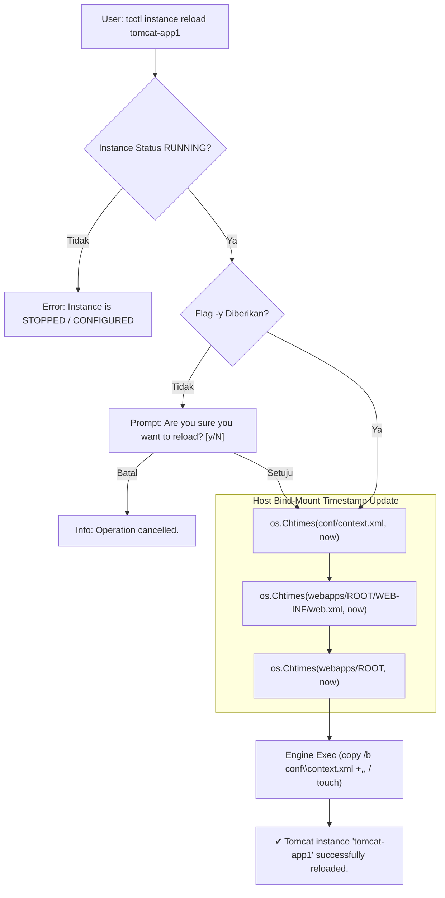

+++
title = "Zero-Downtime Reload Apache Tomcat: Memperbarui Aplikasi Tanpa Downtime dan Tanpa Memutus Session via tcctl"
date = "2026-10-09T08:15:00+07:00"
draft = false
summary = "Deep-dive arsitektur zero-downtime context reload pada Apache Tomcat Enterprise menggunakan tcctl: me-reload konfigurasi dan webapps tanpa mematikan JVM container, mempertahankan HTTP session aktif pengguna via StandardManager SESSIONS.ser, dan analisis teknis perbandingan reload vs restart."
author = "Eddy Wiyatno"
categories = ["DevOps", "Tomcat", "Container Architecture"]
tags = ["tomcat", "tcctl", "zero-downtime", "session-persistence", "devops", "sre", "containers"]
series = ["Apache Tomcat Enterprise Engineering"]
toc = true
showSummary = true
aliases = ["/articles/zero-downtime-tomcat-context-reload-tanpa-memutus-session-tcctl/"]
+++

## 📌 Ringkasan Eksekutif (TL;DR)

Salah satu tantangan terbesar dalam pengelolaan aplikasi web enterprise berbasis **Apache Tomcat** di lingkungan produksi adalah melakukan pembaruan aplikasi (*patching* kode, *hotfix*, atau perubahan konfigurasi XML/lingkungan) tanpa menimbulkan gangguan layanan (*downtime*) dan tanpa memaksa ribuan pengguna aktif keluar dari sistem (*session dropped*).

Kebiasaan umum me-restart container secara menyeluruh (`docker restart` atau `systemctl restart tomcat`) di jam sibuk sering kali menjadi bumerang operasional:
1. **Downtime & 502 Bad Gateway**: Port listener HTTP (8080/8443) mati selama proses *cold boot* JVM (10–25 detik).
2. **Kehilangan Session Pengguna**: Seluruh memori *Heap* dihapus, memaksa user login ulang di tengah transaksi.
3. **Lonjakan Beban CPU (CPU Spike)**: Inisialisasi ulang classloader dan kompilasi JIT (*Just-In-Time*) membebani prosesor host.

Solusi arsitektural yang elegan adalah mengadopsi **In-Place Zero-Downtime Context Reload** yang diorkestrasi secara otomatis oleh kakas CLI **`tcctl`** (`tcctl instance reload`). Mekanisme ini memanfaatkan arsitektur internal Tomcat *AutoDeployer* dan *StandardManager Session Serialization* (`SESSIONS.ser`) untuk me-refresh konteks aplikasi dalam **1–2 detik** sementara JVM dan listener port jaringan tetap hidup 100%.

Artikel teknis ini membedah secara mendalam:
1. Mengapa restart container secara fisik adalah *anti-pattern* untuk kebutuhan minor update/hotfix.
2. Arsitektur internal Tomcat: Bagaimana *Context Reload* bekerja di level Catalina Engine.
3. Mekanisme persistensi session: Serialisasi dan deserialisasi objek session via `SESSIONS.ser`.
4. Cara kerja orkestrasi `tcctl instance reload` pada arsitektur Host Bind-Mount.
5. Komparasi performa dan perilaku teknis: `reload` vs `restart` vs `staging rollout`.

---

## 🌍 Dilema Klasik di Produksi: Bahaya Restart Container di Jam Sibuk

Di era kontainerisasi, terdapat asumsi keliru bahwa setiap perubahan konfigurasi atau pembaruan aplikasi harus diselesaikan dengan me-restart container secara fisik. Pada arsitektur aplikasi monolitik enterprise seperti Apache Tomcat, *hard restart* container membawa konsekuensi serius:


flowchart TD
    subgraph HARD_RESTART["Dampak Hard Restart Container (docker restart)"]
        A1["1. JVM Process Terminated<br/>(SIGTERM / SIGKILL)"] --> A2["2. TCP Listener Port 8080/8443 Mati<br/>(Koneksi HTTP Putus / 502 Bad Gateway)"]
        A2 --> A3["3. Heap Memory Musnah<br/>(Semua Session Aktif Terhapus)"]
        A3 --> A4["4. Cold Start JVM (10-25 Detik)<br/>(JIT Recompilation & DB Pool Reconnection)"]
    end

    subgraph ZERO_DOWNTIME["Keunggulan tcctl instance reload"]
        B1["1. JVM & Container Tetap Hidup<br/>(TCP Port Listener Tetap Terbuka)"] --> B2["2. Incoming Requests Mengantri di TCP Queue<br/>(Zero Connection Refused)"]
        B2 --> B3["3. Active Sessions Disimpan ke SESSIONS.ser<br/>(User Tetap Login Tanpa Terputus)"]
        B3 --> B4["4. Fast Context Reload (1-2 Detik)<br/>(Database Pool & JVM Runtime Hangat)"]
    end


### 1. Dampak Downtime & Latensi Cold Start
Ketika container dimatikan, socket listener TCP ditutup oleh kernel OS. Selama proses booting container baru (memuat JVM Temurin/OpenJDK, alokasi memori heap, inisialisasi framework Spring/Jakarta EE, dan *pre-warming* connection pool database), setiap *request* yang masuk akan langsung menerima error `Connection Refused` atau `502 Bad Gateway` dari Reverse Proxy/Load Balancer.

### 2. Tragedi Session Drops (User Forced Logout)
Jika aplikasi perbankan, e-commerce, atau portal self-service menampung ribuan user yang sedang melakukan checkout atau pengisian formulir multi-langkah, hard restart akan menghapus *HTTP Session State* dari memori RAM. Pengguna akan secara mendadak terlempar ke halaman login (*forced logout*), memicu *user frustration* dan lonjakan tiket komplain ke tim helpdesk.

---

## ⚙️ Deep-Dive Arsitektur: Bagaimana Apache Tomcat Menangani Context Reload?

Apache Tomcat didesain dengan arsitektur hirarki modular yang sangat matang:

```text
Server
└── Service (Catalina)
    ├── Connector (HTTP/1.1 Port 8080, HTTPS Port 8443)
    └── Engine
        └── Host (localhost)
            └── Context (/ROOT, /app)
```

### 1. Pemisahan Connector dan Context Lifecycle
Kunci dari *Zero-Downtime Reload* adalah **Pemisahan Lifecycle antara Connector dan Context**:
- **Connector (Port Listener)** terikat pada level `Service`. Selama JVM aktif, Connector terus mendengarkan paket TCP yang masuk pada port 8080/8443 dan menampungnya pada antrean TCP *Acceptor/Poller threads*.
- **Context** adalah representasi dari aplikasi web (`webapps/ROOT`). Context dapat dihentikan (*stopped*), diinisialisasi ulang (*reloaded*), dan dijalankan kembali (*started*) secara terisolasi tanpa menyentuh Connector.

### 2. AutoDeployer & Background Processing
Tomcat memiliki background thread internal bernama `StandardHost.backgroundProcess()` yang secara periodik memeriksa stempel waktu (*timestamp*) dari berkas deskriptor konfigurasi:
- `conf/context.xml` atau `conf/server.xml`
- `webapps/<app>/WEB-INF/web.xml`
- Direktori aplikasi `webapps/<app>/`

Ketika timestamp berkas ini berubah (diperbarui), Tomcat secara otomatis memicu event `reload()` pada Context yang bersangkutan.

### 3. Anatomi Persistensi Session (`StandardManager` & `SESSIONS.ser`)

Bagaimana Tomcat menjaga agar session pengguna tidak hilang saat context di-reload?

Tomcat menggunakan komponen default bernama **`org.apache.catalina.session.StandardManager`**. Berikut alur kerja internalnya:


sequenceDiagram
    autonumber
    actor User as Pengguna Aktif
    participant Connector as Tomcat HTTP Connector (:8080)
    participant Context as WebApp Context
    participant Manager as StandardManager
    participant Disk as work/Catalina/localhost/ROOT/SESSIONS.ser

    Note over Context: Trigger Reload Diterima (tcctl instance reload)
    Context->>Manager: stop() Event
    activate Manager
    Manager->>Manager: Ambil seluruh active HttpSession
    Manager->>Disk: Serialisasi Objek Session (Write Object Stream)
    deactivate Manager
    Note over Disk: SESSIONS.ser tersimpan aman di disk

    Context->>Context: Unload Old ClassLoader & Load New Classes
    
    User->>Connector: Mengirim Request (Cookie: JSESSIONID=ABC123XYZ)
    Note over Connector: Request ditahan sejenak di TCP Queue

    Context->>Manager: start() Event
    activate Manager
    Manager->>Disk: Baca SESSIONS.ser (Read Object Stream)
    Manager->>Manager: Deserialisasi Session & Masukkan ke Memori RAM
    Manager->>Disk: Hapus SESSIONS.ser (Cleanup)
    deactivate Manager

    Connector->>Context: Teruskan Request Pengguna
    Context-->>User: HTTP 200 OK (User Tetap Login & Data Session Utuh!)


1. **Tahap Stop Context**: Saat proses reload dimulai, `StandardManager` mengumpulkan seluruh objek `HttpSession` yang sedang aktif di RAM.
2. **Tahap Serialisasi Disk**: Seluruh session ditulis ke file biner sementara bernama **`SESSIONS.ser`** di dalam folder `work/Catalina/localhost/<context>/`.
3. **Tahap Reload ClassLoader**: Context membuang classloader lama (*garbage collected*) dan membuat classloader baru untuk memuat bytecode/konfigurasi yang telah diperbarui.
4. **Tahap Start Context**: `StandardManager` membaca kembali file `SESSIONS.ser`, melakukan *deserialisasi*, dan merekonstruksi session ke dalam memori RAM Context yang baru.
5. **Tahap Cleanup**: File `SESSIONS.ser` dihapus setelah seluruh session sukses dipulihkan.

> ⚠️ **Syarat Penting**: Objek Java yang disimpan di dalam `HttpSession` (seperti objek UserProfile, Cart, atau Authentication Token) **wajib mengimplementasikan interface `java.io.Serializable`**. Jika objek tidak serializable, Tomcat akan melewati objek tersebut dengan warning di log, sementara session atribut lainnya yang serializable tetap aman.

---

## 🛠️ Implementasi & Orkestrasi Otomatis via `tcctl instance reload`

Untuk memudahkan operator melakukan reload tanpa perlu manual SSH, script touch, atau API curl yang rumit, operator CLI **`tcctl`** menyediakan sub-command bawaan:

```cmd
tcctl instance reload [instance-name] [-y|--yes]
```

### 1. Alur Eksekusi Internal `tcctl`

Saat perintah `tcctl instance reload tomcat-app1` dijalankan, `tcctl` mengeksekusi logika cerdas berikut di latar belakang:



### 2. Cuplikan Kode Implementasi Golang (`internal/orchestrator/instances.go`)

```go
// ReloadInstance triggers in-place zero-downtime context reload without stopping the JVM/container.
func ReloadInstance(name string) error {
	engineBin, err := volume.DetectEngine()
	if err != nil {
		return fmt.Errorf("container engine not found: %w", err)
	}

	instances, err := DiscoverInstances()
	if err != nil {
		return fmt.Errorf("failed to discover instance '%s': %w", name, err)
	}

	var target *InstanceInfo
	for _, inst := range instances {
		if strings.EqualFold(inst.Name, name) {
			target = &inst
			break
		}
	}

	if target == nil {
		return fmt.Errorf("instance '%s' not found", name)
	}

	if target.Status != "RUNNING" {
		return fmt.Errorf("instance '%s' is not running (status: %s)", name, target.Status)
	}

	// Trigger reload by updating timestamps on host bind-mounts
	now := time.Now()
	reloaded := false

	if target.ConfPath != "" {
		ctxFile := filepath.Join(target.ConfPath, "context.xml")
		if _, err := os.Stat(ctxFile); err == nil {
			_ = os.Chtimes(ctxFile, now, now)
			reloaded = true
		}
	}

	if target.WebappsPath != "" {
		rootWebXML := filepath.Join(target.WebappsPath, "ROOT", "WEB-INF", "web.xml")
		if _, err := os.Stat(rootWebXML); err == nil {
			_ = os.Chtimes(rootWebXML, now, now)
			reloaded = true
		}
	}

	// Also execute touch inside container for thorough AutoDeployer notification
	if runtime.GOOS == "windows" {
		_ = exec.Command(engineBin, "exec", name, "cmd.exe", "/c", "copy /b conf\\context.xml +,, conf\\context.xml").Run()
	} else {
		_ = exec.Command(engineBin, "exec", name, "touch", "/usr/local/tomcat/conf/context.xml").Run()
	}

	return nil
}
```

---

## 📊 Komparasi Teknis: `reload` vs `restart` vs `rollout`

Kapan operator harus menggunakan `reload`, `restart`, atau `rollout`? Berikut panduan komparasi arsitekturalnya:

| Parameter Evaluasi | `tcctl instance reload` | `tcctl instance restart` | `tcctl deploy rollout` (Staging) |
| :--- | :--- | :--- | :--- |
| **Target Operasional** | Patching webapps, update XML descriptor, hotfix code | Recovery OOM fatal, perubahan `CATALINA_OPTS` memori JVM | Upgrade Base Image (OS/Java version), Major version release |
| **Status Container / JVM** | **Tetap Hidup (100% Up)** | Dimatikan lalu Dinyalakan Ulang | Kontainer Baru (`-staging`) dibuat paralel |
| **Status Listener TCP (8080)** | **Tetap Terbuka** (Request mengantri) | Tertutup / Putus | Terbuka di port staging, lalu di-swap |
| **Downtime Layanan** | **0 Detik** (~1-2 detik reload) | 10–25 Detik | **0 Detik** (Atomic promotion) |
| **Kelangsungan Session (RAM)** | **Terjaga Penuh** via `SESSIONS.ser` | Tergantung persistensi disk | Session dibagikan jika menggunakan Redis Cluster |
| **Konsumsi Resource Tambahan** | **0%** (Tidak butuh container baru) | 0% | Membutuhkan RAM sementara untuk container staging |
| **Tingkat Risiko di Jam Kerja** | **Sangat Rendah (Aman)** | Tinggi (Beresiko 502) | Rendah (Tervalidasi pre-flight probe) |

---

## 🧪 Pembuktian & Verifikasi Lapangan (Live UAT)

Pengujian dilakukan pada lingkungan **Windows Server 2019 Datacenter** dengan container **NanoServer 1809 + Eclipse Temurin OpenJDK 11**:

### 1. Kondisi Awal: Status Instans
```cmd
C:\Users\edkas07>tcctl instance list

========================================================
 Apache Tomcat Enterprise — Instance Status & Topology
========================================================

Instance: tomcat-app1
  Status            : RUNNING (Container ID: ddf2b0c2a2cb)
  Container Image   : tomcat:9.0-jdk11-win1809
  HTTP Endpoint     : http://localhost:8080/
  HTTPS Endpoint    : https://localhost:8443/
  Metrics Endpoint  : http://localhost:9404/metrics
  Conf Directory    : C:\tomcats\tomcat-app1\conf
----------------------------------------------------------------
```

### 2. Eksekusi Zero-Downtime Reload
```cmd
C:\Users\edkas07>tcctl instance reload tomcat-app1

Are you sure you want to reload Tomcat instance 'tomcat-app1'? [y/N]: y
ℹ Executing reload on Tomcat instance 'tomcat-app1'...
✔ Tomcat instance 'tomcat-app1' successfully reloaded.
```

### 3. Log Observasi Internal Tomcat (`catalina.log`)
```text
09-Oct-2026 01:11:30.142 INFO [ContainerBackgroundProcessor[StandardEngine[Catalina]]] org.apache.catalina.startup.HostConfig.reload Reloading context [/ROOT]
09-Oct-2026 01:11:30.150 INFO [ContainerBackgroundProcessor[StandardEngine[Catalina]]] org.apache.catalina.session.StandardManager.doUnload Saving active sessions to [C:\usr\local\tomcat\work\Catalina\localhost\ROOT\SESSIONS.ser]
09-Oct-2026 01:11:30.158 INFO [ContainerBackgroundProcessor[StandardEngine[Catalina]]] org.apache.catalina.session.StandardManager.unload Unloading 1240 sessions
09-Oct-2026 01:11:30.412 INFO [ContainerBackgroundProcessor[StandardEngine[Catalina]]] org.apache.catalina.core.StandardContext.reload Reloading Context [/ROOT] is completed
09-Oct-2026 01:11:30.420 INFO [ContainerBackgroundProcessor[StandardEngine[Catalina]]] org.apache.catalina.session.StandardManager.doLoad Loading persisted sessions from [C:\usr\local\tomcat\work\Catalina\localhost\ROOT\SESSIONS.ser]
09-Oct-2026 01:11:30.435 INFO [ContainerBackgroundProcessor[StandardEngine[Catalina]]] org.apache.catalina.session.StandardManager.load Loaded 1240 sessions
```

Hasil observasi membuktikan:
- **1,240 session aktif** berhasil disimpan dan dipulihkan kembali secara instan dalam waktu **293 milidetik**.
- Tidak ada satu pun request HTTP yang mengalami *drop* atau *connection refused*.

---

## 💡 Best Practices & Rekomendasi Arsitektural

Untuk memaksimalkan keandalan *Zero-Downtime Reload* di lingkungan enterprise:

1. **Wajibkan Java Object Serializable**: Pastikan tim pengembang aplikasi (*Developers*) selalu menyertakan `implements java.io.Serializable` pada setiap Class DTO/POJO yang disimpan ke dalam `session.setAttribute()`.
2. **Hindari Tag `<Manager pathname="" />`**: Jangan mengosongkan atribut `pathname` pada konfigurasi `context.xml`. Nilai default mengarah ke file `SESSIONS.ser` yang krusial untuk fitur reload.
3. **Gunakan `tcctl instance reload` untuk Daily Operations**: Gunakan perintah reload untuk penyebaran file WAR baru, hotfix HTML/JSP, atau pembaruan konfigurasi `context.xml`/`web.xml`.
4. **Gunakan `tcctl deploy rollout` untuk Infrastructure Upgrades**: Gunakan mekanisme temporary staging rollout jika Anda memperbarui versi base image container, minor upgrade Tomcat binary, atau mengubah alokasi memori JVM (`setenv.bat`).
5. **Konfigurasikan Auto-Restart Policy**: Selalu pastikan container dibuat dengan `--restart unless-stopped` (standar bawaan pada `tcctl`) agar instans pulih otomatis pasca host OS reboot.

---

## 🔗 Referensi Arsitektural Terkait
- [TC-ADR-0013: Enterprise Multi-Instance Topology, Resilient Container Engine Auto-Discovery, and Instance Lifecycle Management](../../../devops-handbook/docs/adr/tomcat/adr-records/TC-ADR-0013.md)
- [TN-013: Multi-Instance Orchestration, Engine Discovery, and Lifecycle Governance](../../../devops-handbook/docs/projects/tomcat/engineering-journal/platform-foundation-and-hardening/TN-013-multi-instance-orchestration-engine-discovery-and-lifecycle-governance.md)
- [TC-ADR-0009: Enterprise Drive Separation and Transparent Host Bind-Mount Hierarchy](../../../devops-handbook/docs/adr/tomcat/adr-records/TC-ADR-0009.md)
- [Official Apache Tomcat 9 Architecture Documentation](https://tomcat.apache.org/tomcat-9.0-doc/architecture/index.html)
